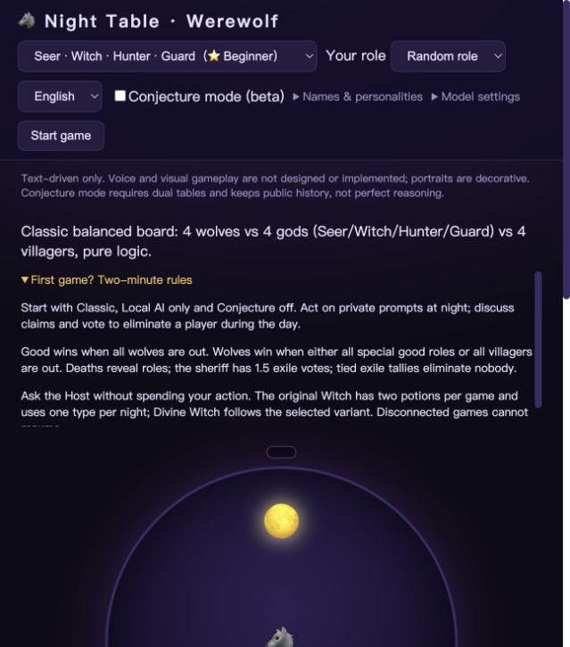

# Pre-publication audit — 2026-09-06 UTC

## Verdict and scope

The local candidate is suitable for an **experimental, local-first public alpha**
on software/functionality grounds, with the publication gates below still open.
It is not a production multiplayer service, a proven-balanced game, an ideal
rationality simulator or a fully accessibility-audited product.

Reviewed: installation, English/Chinese documentation, architecture and extension
paths, role/mode clarity, executable game flows, information boundaries, frontend
interactions, research reproducibility, dependencies, licenses/assets, local Git
history and GitHub metadata. Clear defects were fixed; game balance was not
silently changed. No provider experiment, commit, push, PR merge, visibility
change, credential change or history rewrite was performed.

Baseline local commit: `8ac9265`, plus the pre-existing uncommitted feature work
and this audit's fixes. GitHub `master` was still `1ac9240` at review time. Its
green checks are **not evidence for this uncommitted candidate**.

## Verified evidence

| Check | Current-run result | Boundary |
| --- | --- | --- |
| Clean installation | New Python 3.12 virtual environment, release files only, README requirements install; `pip check` clean | macOS ARM64; Windows and other Python versions await CI/manual checks |
| Python suite | **190 tests pass**, also in the clean candidate copy | Includes a 40-match matrix: 10 boards × 2 languages × 2 modes; additional selected-role and edge tests, not 190 independent matches |
| Frontend | Lockfile-only clean `npm ci`, DOM integration tests and both JS syntax checks pass | Node 24.20; mocked transport in DOM tests, actual browser evidence separately below |
| Dependencies | `pip-audit` reports no known vulnerabilities in resolved requirements; npm audit reports zero | Time-specific database results, not a guarantee or a fully frozen Python transitive dependency lock |
| Release hygiene | Relative Markdown file targets, required release files, ten twelve-seat rosters and credential-pattern checks pass | Anchors and every remote link are not checked |
| Local history | 119 reachable Git blobs checked for selected credential patterns, no matches | Local refs only; not every secret format or arbitrary personal text |
| Divine Witch v2 | All **96** games exactly replay with archived original source/hash matches; all **96** also reproduce on the candidate via explicit compatibility mode | Same outcomes/trajectories, not 192 new independent experiments or proof of balance |
| Earlier Codex experiments | All four artifacts reproduce requests, terminal state, usage and source hashes | Two originally completed, two originally failed; the failures remain failures, not wins |
| External game-model calls | **0** during this audit | Package registries, vulnerability databases and read-only GitHub checks used the network |

The release hygiene script also inspects compressed JSON research payloads and
the source archive. A pass does not clear image metadata, authorship, copyright,
arbitrary private facts or all possible credentials.

## Fixed in this pass

1. **Duplicate event consumers could start another loop for one game.** Reserve
   the HTTP stream before returning it, reject a duplicate with 409, guard direct
   repeated `events()` use, cancel on disconnect and clear pending actions.
   Added regression tests for duplicate streams and cancellation.
2. **Malformed API requests could become server errors.** Shared object/JSON/ID
   validation returns 422 across start, action and rules-chat routes. Invalid
   actions leave the turn pending. Speech is capped at 4,000 characters and rules
   questions at 320; this is not a general request-size/rate-limit defense.
3. **Most selected roles lacked their own ability explanation in the role card.**
   Every selectable role now has localized private help. A test walks all board,
   role and language combinations. Long ability text is expandable in the UI.
4. **Documentation disagreed with implemented rules and setup.** Corrected finite
   vs unlimited/dual potions, test-matrix scope, and fresh terminal memory scopes.
   Added a bilingual [first-game guide](PLAYER_GUIDE.md), in-page quick rules and
   an [architecture/extension guide](ARCHITECTURE.md). English and Chinese READMEs
   now describe clean installation and reproducible frontend checks.
5. **Frontend regression tests depended on a private temporary installation.**
   Added `package.json`, a lockfile, `npm test`, CI execution and npm Dependabot.
   Updated CI action pins to official verified checkout 7.0.1 / setup-python 7.0.0 /
   setup-node 7.0.0 commits, matching the repository's existing Dependabot proposals.
   Those remote PRs were not merged; the combined updated workflow still needs CI.
6. **Short desktop layouts let the decorative table overlap the board description.**
   Sized the table against its available area, bounded long rule/action panels,
   constrained settings fields, and added visible keyboard focus. Labeled rule
   questions, speech and potion controls, plus log/status semantics.
7. **Later code changes would strand an uncommitted experiment's source hashes.**
   Preserved the actual v2 Python/board/persona source in a metadata-normalized
   archive. The audit distinguishes original-source verification from newer-code
   compatibility replay. Original results were not overwritten or relabeled.

## Gameplay, rules and architectural assessment

The core split is reasonable for this scale: the engine adjudicates, local NPC
brains choose actions, optional models rephrase, and browser/chat share a session.
Stable slot IDs, names, preset identities and hidden roles remain separate.
The extension guide identifies the actual edit points rather than promising a
plugin system that does not exist.

The default should remain Classic + normal mode + local AI. Optional Conjecture
beta adds two tables and complete public-table history but not exhaustive semantic
reasoning. Divine Witch keeps strong powers visible and allows counterplay through
mistaken poison, Guard/rescue coordination and Witch survival. The observed 16/32
good wins in each unlimited arm do **not** prove competitive balance or enjoyment.

Newcomers must be told this variant flips dead roles publicly and uses elimination
of all wolves versus all special good roles **or** all villagers. It is not merely
wolf/good parity. Guard plus rescue is fatal; self-save is first-night only. These
rules are documented, not silently replaced with another community's variant.

Important remaining limitations:

- Normal language parsing and online intent checks are heuristic; wording can be
  repetitive or inconsistent. No human playtest study established enjoyment.
- Conjecture asks for 24 judgments per submission and substantial reading; it is
  deliberately research-oriented and should not be the first-game default.
- Gravekeeper information is strategically redundant while deaths publicly flip.
  Knight/White Wolf King actions use fixed turn windows, not arbitrary interrupts.
- NPC adapters hold an engine reference: privacy is a tested coding convention,
  not a formally enforced capability boundary. No full noninterference proof.
- `run.py` still houses both the shared session and FastAPI. Extract it later in
  a focused, replay-preserving refactor; do not duplicate the phase loop.
- No reconnect, accounts, durable sessions, idle-session cleanup or multi-worker
  state. Synchronous model calls can delay other sessions. Keep it localhost-only.
- Portraits are not behavioral signals; voice/visual gameplay remains undesigned.

## Actual-browser UX and accessibility evidence

Goal: a first-time English/Chinese player can set up, understand their role, ask
private rules questions and make legal actions without understanding the code.
Review used the real local server in the Codex in-app browser, not mocked API
responses. Screenshots were captured and inspected in this run.

| Step | Observed state / health | Evidence or limit |
| --- | --- | --- |
| 1. Setup | Ten boards, English/Chinese, role choice, normal/conjecture and personality settings are discoverable. Initial desktop board text was obscured: fixed. | [Before](audit-assets/before-settings-en.png), [after layout fix](audit-assets/fixed-settings-en.png), both 1280 × 720 |
| 2. First-game help | New expandable quick rules render in English; Chinese entry also inspected. Matches the documented win conditions and potion distinction. | [Final English guide](audit-assets/final-guide-en.png) |
| 3. Divine Witch night | Selected Witch in dual + Conjecture, local expression, received only the legal rescue victim and poison choices. Both targets stayed selected. | [Rules and dual choice](audit-assets/divine-rules-choice.png); this image precedes the final label/panel polish |
| 4. Private rules help | Asked whether both potions can be used; got the correct variant answer while the night action remained available. | Same screenshot; submitted both potions and reached dawn |
| 5. Election | Declined sheriff candidacy, chose a candidate, submitted a vote and reached the table editor. | Actual accessibility/UI state and successful server responses; not a whole-game video |
| 6. Conjecture | Edited the public own-role row and rationale, submitted both drafts; all living actors received expandable public v1 records. | [Editor](audit-assets/conjecture-editor.png); death remained a table subject |
| 7. Normal mode | Started a separate Classic/Seer game with Conjecture off. Role card showed Seer ability; night target buttons appeared. | Actual post-fix browser state; full match termination separately tested |
| 8. Final page | Fresh final-server page, guide translation and visible content verified; captured browser error/warning list empty. | Final guide image; old cached scripts required a fresh local origin for reliable verification |



Strengths: private rules help is separate from turns; legal target choices reduce
command ambiguity; public conjectures are explicitly claims, not truth; ordinary
play does not require research forms. Main remaining UX costs: long variant rules,
multiple scrolling regions, repeated local speech and no connection recovery.

Accessibility work here is limited. Labels, native controls, focus outline and
live-log semantics were checked in source/DOM and observed in the browser. No
complete screen-reader, keyboard-only, contrast, zoom or WCAG conformance audit
was performed. At a requested 390-pixel viewport, screenshot capture produced
white/duplicated regions; those images were rejected as evidence. The natural
narrow app view was inspected, but **phone-size visual sign-off remains open**.
No complete manual real-browser match through the review dialog was performed;
automated shared-session tests cover termination/review instead.

## Publication gates — still required before visibility changes

1. **Publication privacy decision.** All twelve portraits still contain EXIF
   generation metadata including provider/content identifiers. Local history has
   two distinct non-noreply author email addresses; earlier persona text also
   retains pre-cleanup nicknames. Decide whether to publish that history as-is or
   prepare a sanitized public snapshot/history. Removing current metadata alone
   does not remove earlier Git blobs. No history rewrite was authorized or done.
2. **Asset/text scope.** Portrait ownership and publication permission were already
   confirmed by the maintainer; do not request that same approval again. Code is
   MIT, portraits have separate project-publication permission, not a standalone
   open asset license. **Follow-up: the maintainer separately confirmed personal
   authorship of persona descriptions and catchphrases, closing the outstanding
   text-source question.** See [ASSETS.md](ASSETS.md). Historical identifiers remain
   a separate privacy decision; authorship is not an independent legal audit.
3. **Release commit and its own CI.** Commit/push the intended release files only,
   then require the candidate's `test (3.10)`, `test (3.12)`, `test (3.13)` and
   `dependencies` checks to pass. Current local verification is Python 3.12;
   old master/Dependabot greens do not close this gate. The repo currently has no
   remotely recognized license because the local LICENSE has not been published.
4. **GitHub publication settings.** Repository remains private; master is not
   protected. Apply the agreed force-push/deletion protection and required checks
   with publication, and verify private vulnerability reporting/security settings
   in the account UI. The API returned no visible security configuration; absence
   of that field was not interpreted as proof that every feature is disabled.

Community profile reported 71% on the older remote default branch. README,
contributing and PR template were recognized; the local issue template exists
but was not recognized by that endpoint. This percentage is not a release-quality
score. A code of conduct is optional future community governance, not fabricated
as a maintainer promise during this audit.

## Re-run

```sh
python -m unittest discover -s tests -q
npm ci
npm test
npm run check
python scripts/check_release.py --history
python -m pip_audit -r werewolf_web/requirements.txt --progress-spinner off
python tests/audit_divine_witch.py docs/research-runs/divine-witch-local-2026-09-06-v2.json.gz --compare-current
```

`pip-audit` is an optional development tool installed separately. Original-source
replay instructions are in [Divine Witch](DIVINE_WITCH.md). Preserve evidence,
report failed trials honestly, and rerun after the final release commit.
